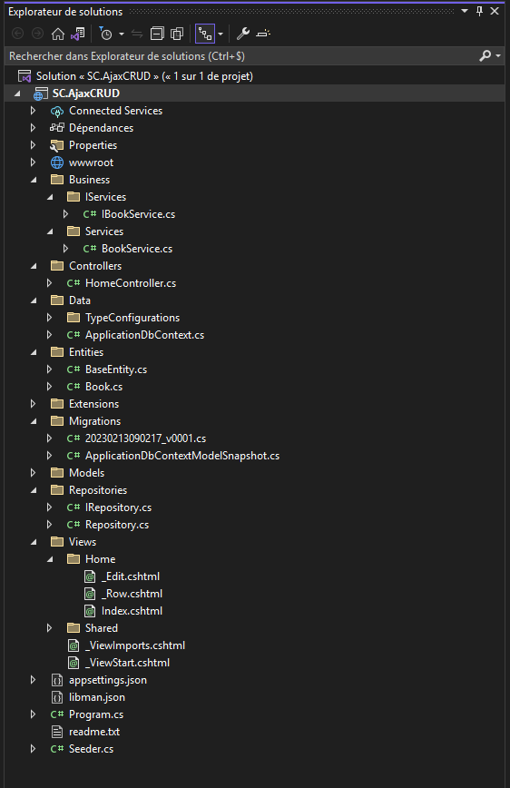
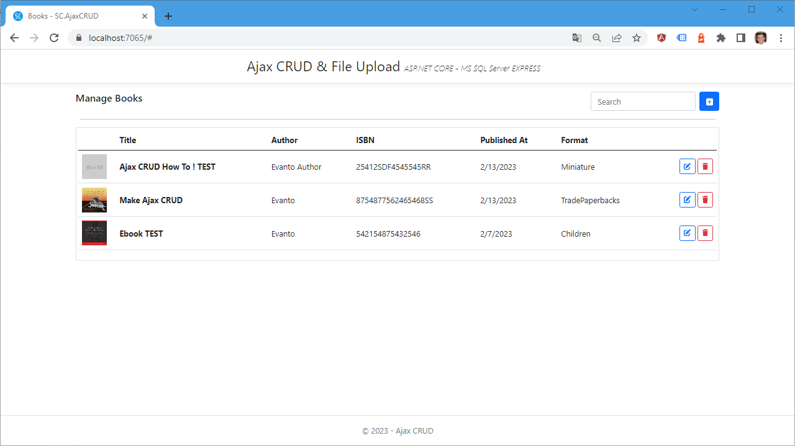
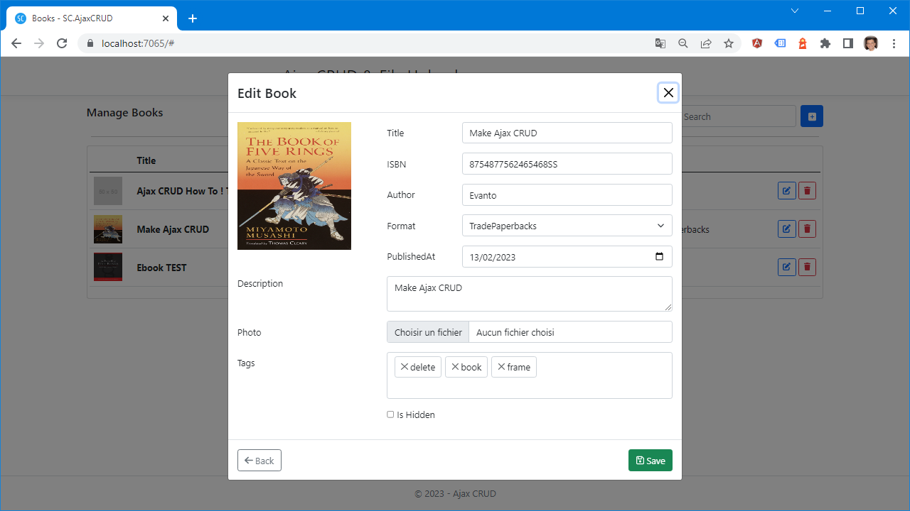
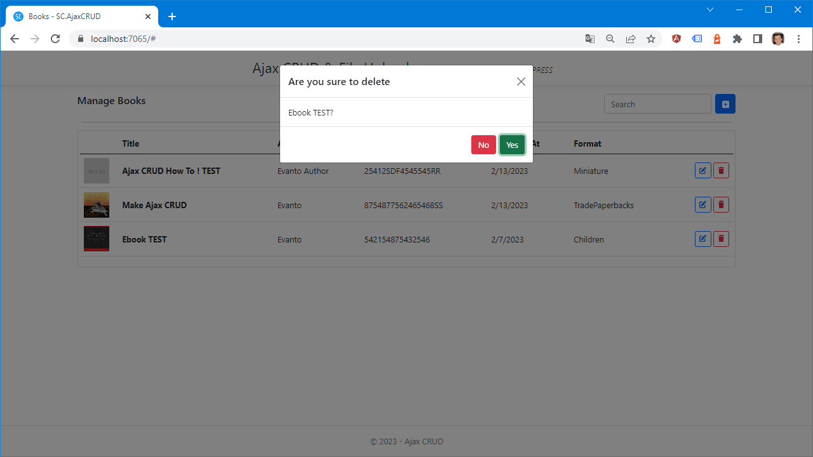

Getting Started
=====

SC Ajax CRUD is an ASP.NET CORE MVC 6 Project that implement full Ajax CRUD Operations with File Upload.

   

		

		

   
   
Key Features
------------

- Asp.net Core MVC 6.
- MS SQL Server Express.
- File Upload.
- Persist data on database.
- Full Ajax operations.
- Well structured & Designed solution.
- Clean code.
- EntityFrameworkCore Code First.
- Seperated Business Patterns.
- Generic Repository Pattern.
- Full commented source codes.
- Jquery based prototype pattern.
 

Environment
----------------

To build the Solution you need to have:
			- Visual Studio 2022
			- Microsoft SQL Server Express (2014 or later)
			- Micrsoft .NET 6 SDK

Settings
------------

Before building the solution, make sure to have the correct parameters on the appsettings.json.

- **ConnectionStrings**  :  Default Connection String of the database 

   
Build & Run
------------

After updating settings, you can build and Run the solution.

The Project use EntityFrmaeworkCore Code First, so the database will be created automatically on project Startup.
   
